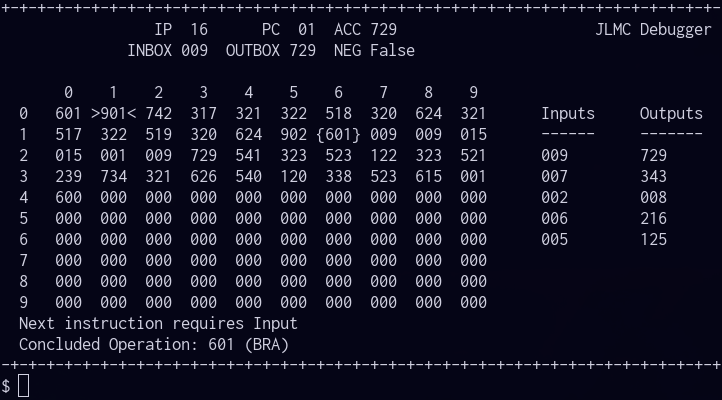

## JLMC

JLMC is an emulator for the Little Man Computer architecture designed to mirror the semantics of Magnus Bordewich's [Little Minion Computer](http://community.dur.ac.uk/m.j.r.bordewich/LMC.html).

    $ python3 jlmc.py FILENAME [--debug] [--run]
    $ ... | python3 jlmc.py -- [--debug] [--run]

JLMC reliably emulates LMC programs, supporting both standard and nonstandard mnemonics.

Passing the flag `--debug` to JLMC enters the debugger, which shows a overview of the machine state and has some useful commands:

* `breakpoint {LABEL|ADDRESS}` - Add a breakpoint
* `delpoint {LABEL|ADDRESS}` - Remove a breakpoint
* `listpoints` - List Breakpoints
* `run` - Execute program until a breakpoint is hit or input is required
* `step` - Execute program one instruction at a time
* `reset` - Set PC to 0 (but does NOT reload program from disk)
* `coredump` - Output program memory as raw sequence of integers

By default the debugger starts in step mode, use `--run` to start it in run mode.
